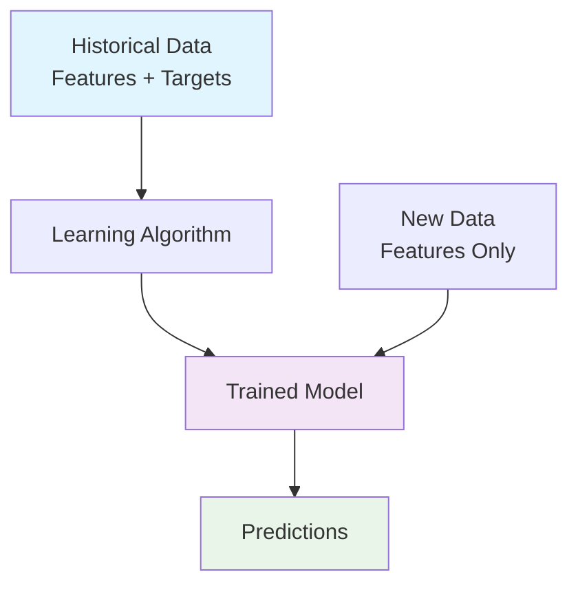

# 1.1 What is Machine Learning?

> **Understanding the fundamental concept of machine learning through practical examples**

## 🎯 Learning Objectives

- Understand what machine learning is and how it works
- Learn the key components: features, targets, and models
- See how ML extracts patterns from data
- Understand the prediction process with real examples

## 📺 Video Lecture

[](https://www.youtube.com/watch?v=Crm_5n4mvmg&list=PL3MmuxUbc_hIhxl5Ji8t4O6lPAOpHaCLR&index=2)

**Duration**: ~15 minutes  
**Slides**: [Introduction to Machine Learning](https://www.slideshare.net/AlexeyGrigorev/ml-zoomcamp-11-introduction-to-machine-learning)

## 🧠 Core Concepts

### What is Machine Learning?

Machine Learning is a process of **extracting patterns from data** to make predictions on new, unseen data. Instead of programming explicit rules, we let the algorithm discover patterns automatically.

### The Car Price Example

Let's understand ML through a practical example: predicting car prices.

#### Traditional Approach (Rule-Based)
```python
def predict_car_price(year, mileage, brand):
    base_price = 20000
    
    # Manual rules
    if year > 2020:
        base_price += 5000
    elif year > 2015:
        base_price += 2000
    
    if mileage < 50000:
        base_price += 3000
    elif mileage > 100000:
        base_price -= 5000
    
    if brand == "BMW":
        base_price += 8000
    elif brand == "Toyota":
        base_price += 3000
    
    return base_price
```

**Problems with this approach:**
- Rules become complex and hard to maintain
- Difficult to handle interactions between features
- Requires domain expertise for every rule
- Doesn't adapt to new data patterns

#### Machine Learning Approach

Instead of writing rules, we:
1. **Collect data** about cars with known prices
2. **Let the algorithm learn** patterns from this data
3. **Use the learned model** to predict prices for new cars

```python
# Simplified ML approach
import pandas as pd
from sklearn.linear_model import LinearRegression

# 1. Prepare data
data = pd.DataFrame({
    'year': [2018, 2019, 2020, 2017, 2021],
    'mileage': [45000, 32000, 15000, 78000, 8000],
    'brand_BMW': [1, 0, 1, 0, 1],
    'brand_Toyota': [0, 1, 0, 1, 0],
    'price': [25000, 22000, 35000, 18000, 42000]
})

# 2. Define features and target
X = data[['year', 'mileage', 'brand_BMW', 'brand_Toyota']]
y = data['price']

# 3. Train the model
model = LinearRegression()
model.fit(X, y)

# 4. Make predictions
new_car = [[2020, 30000, 1, 0]]  # 2020 BMW with 30k miles
predicted_price = model.predict(new_car)
print(f"Predicted price: ${predicted_price[0]:,.2f}")
```

## 🔑 Key Components

### 1. Features (X)
**Definition**: Input variables that describe the objects we want to make predictions about.

**Examples for car price prediction:**
- **Numerical features**: Year, mileage, engine size, number of doors
- **Categorical features**: Brand, model, fuel type, transmission
- **Derived features**: Age of car (current_year - year), price per mile

```python
# Feature matrix example
features = [
    [2020, 25000, 2.0, 4, 'BMW', 'Sedan', 'Gasoline', 'Automatic'],
    [2018, 45000, 1.8, 4, 'Toyota', 'Hatchback', 'Hybrid', 'CVT'],
    [2019, 32000, 3.0, 2, 'BMW', 'Coupe', 'Gasoline', 'Manual']
]
```

### 2. Target Variable (y)
**Definition**: The output we want to predict.

**Examples:**
- **Regression targets**: Car price ($25,000), house price, temperature
- **Classification targets**: Spam/not spam, cat/dog, buy/sell/hold

```python
# Target vector example
targets = [35000, 22000, 45000]  # Car prices in dollars
```

### 3. Model (g)
**Definition**: The learned function that maps features to targets.

**Mathematical representation:**
```
g(X) ≈ y
```

Where:
- `g` is our model function
- `X` is the feature matrix
- `y` is the target vector

### 4. Training Process
**Definition**: The process of finding the best model function using historical data.

```python
# Training process visualization
def training_process():
    """
    1. Collect historical data (features + targets)
    2. Choose a learning algorithm
    3. Feed data to the algorithm
    4. Algorithm finds patterns and creates model
    5. Validate model performance
    """
    pass
```

### 5. Prediction Process
**Definition**: Using the trained model to make predictions on new data.

```python
# Prediction process
def prediction_process(trained_model, new_features):
    """
    1. Prepare new data (same format as training)
    2. Apply trained model to new features
    3. Get prediction (without knowing true target)
    """
    prediction = trained_model.predict(new_features)
    return prediction
```

## 🔄 The Complete ML Workflow



### Step-by-Step Process

1. **Data Collection**
   ```python
   # Collect historical examples
   historical_data = {
       'features': [[2020, 25000, 'BMW'], [2018, 45000, 'Toyota']],
       'targets': [35000, 22000]
   }
   ```

2. **Pattern Learning**
   ```python
   # Algorithm discovers patterns like:
   # - Newer cars are more expensive
   # - Lower mileage increases price
   # - BMW cars cost more than Toyota
   ```

3. **Model Creation**
   ```python
   # Model encodes learned patterns
   def learned_model(year, mileage, brand):
       # Complex mathematical function
       # that captures discovered patterns
       return predicted_price
   ```

4. **Making Predictions**
   ```python
   # Apply model to new data
   new_car = [2021, 15000, 'BMW']
   price = learned_model(*new_car)
   ```

## 💡 Key Insights

### Why Machine Learning Works

1. **Pattern Recognition**: Algorithms excel at finding complex patterns in data
2. **Scalability**: Can handle thousands of features and millions of examples
3. **Adaptability**: Performance improves with more data
4. **Automation**: Reduces need for manual rule creation

### When to Use Machine Learning

✅ **Good for ML:**
- Large amounts of data available
- Complex patterns exist in data
- Rules are difficult to define manually
- Patterns change over time

❌ **Not ideal for ML:**
- Simple, well-defined rules work
- Very little data available
- High interpretability required
- Real-time constraints are critical

## 🛠️ Practical Example: Complete Implementation

```python
import pandas as pd
import numpy as np
from sklearn.model_selection import train_test_split
from sklearn.linear_model import LinearRegression
from sklearn.metrics import mean_squared_error

# 1. Create sample car data
np.random.seed(42)
n_cars = 1000

data = pd.DataFrame({
    'year': np.random.randint(2010, 2024, n_cars),
    'mileage': np.random.randint(5000, 150000, n_cars),
    'engine_size': np.random.uniform(1.0, 4.0, n_cars),
    'brand': np.random.choice(['BMW', 'Toyota', 'Honda', 'Ford'], n_cars)
})

# Create realistic price based on features
data['price'] = (
    (data['year'] - 2010) * 1000 +  # Newer cars cost more
    (150000 - data['mileage']) * 0.1 +  # Lower mileage costs more
    data['engine_size'] * 3000 +  # Bigger engines cost more
    np.where(data['brand'] == 'BMW', 10000, 0) +  # BMW premium
    np.where(data['brand'] == 'Toyota', 2000, 0) +  # Toyota reliability premium
    np.random.normal(0, 2000, n_cars)  # Random noise
)

# 2. Prepare features (encode categorical variables)
features = pd.get_dummies(data[['year', 'mileage', 'engine_size', 'brand']])
target = data['price']

# 3. Split data
X_train, X_test, y_train, y_test = train_test_split(
    features, target, test_size=0.2, random_state=42
)

# 4. Train model
model = LinearRegression()
model.fit(X_train, y_train)

# 5. Make predictions
y_pred = model.predict(X_test)

# 6. Evaluate performance
mse = mean_squared_error(y_test, y_pred)
rmse = np.sqrt(mse)

print(f"Model Performance:")
print(f"RMSE: ${rmse:,.2f}")
print(f"Average car price: ${y_test.mean():,.2f}")

# 7. Predict price for a new car
new_car = pd.DataFrame({
    'year': [2022],
    'mileage': [25000],
    'engine_size': [2.5],
    'brand': ['BMW']
})

# Encode categorical variables (same as training)
new_car_encoded = pd.get_dummies(new_car)
new_car_encoded = new_car_encoded.reindex(columns=features.columns, fill_value=0)

predicted_price = model.predict(new_car_encoded)
print(f"\nPredicted price for 2022 BMW with 25k miles: ${predicted_price[0]:,.2f}")
```

## 🎯 Summary

Machine Learning is about **learning patterns from data** to make predictions. The key components are:

- **Features**: Input variables describing your data
- **Target**: What you want to predict
- **Model**: The learned function mapping features to targets
- **Training**: Process of learning patterns from historical data
- **Prediction**: Applying the model to new data

This approach is powerful because it:
- Automatically discovers complex patterns
- Scales to large datasets
- Adapts to new data
- Reduces manual rule creation

## 📚 Additional Resources

- **Original Notes**: [Bootcamp Version](../../Bootcamp/01-intro/01-what-is-ml.md)
- **Community Notes**: [Peter Ernicke's Notes](https://knowmledge.com/2023/09/09/ml-zoomcamp-2023-introduction-to-machine-learning-part-1/)
- **Further Reading**: "Pattern Recognition and Machine Learning" by Christopher Bishop

## 🔗 Navigation

- **Previous**: [Module Overview](README.md)
- **Next**: [ML vs Rule-Based Systems](02-ml-vs-rules.md)
- **Course Home**: [Main Guide](../README.md)

---

*Last Updated: 2025-01-27*
